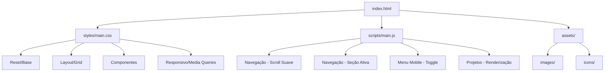

# Documento de Design Técnico

## Visão Geral

Este documento descreve o design técnico do site portfólio pessoal hospedado no GitHub Pages (felipejaques.github.io). O site será construído com HTML, CSS e JavaScript puros (sem frameworks), servido como arquivos estáticos pelo GitHub Pages.

A arquitetura adota o padrão single-page com seções verticais, navegação fixa e design responsivo usando CSS moderno (Flexbox, Grid e Media Queries). O JavaScript gerencia interações como scroll suave, menu mobile e destaque de seção ativa.

## Arquitetura



### Estrutura de Diretórios

```
felipejaques.github.io/
├── index.html              # Página principal (single-page)
├── styles/
│   └── main.css            # Estilos (variáveis, layout, componentes, responsivo)
├── scripts/
│   └── main.js             # Lógica de interação
├── assets/
│   ├── images/             # Imagens do site (foto, screenshots)
│   └── icons/              # Ícones SVG inline ou sprite
└── data/
    └── projects.json       # Dados dos projetos (opcional, pode ser inline)
```

### Decisões Arquiteturais

| Decisão | Escolha | Justificativa |
|---------|---------|---------------|
| Bundler/Framework | Nenhum | Requisito de arquivos estáticos puros para GitHub Pages |
| CSS | Arquivo único com variáveis CSS | Manutenibilidade sem build step |
| JavaScript | Módulo único vanilla | Sem dependências externas, carregamento rápido |
| Ícones | SVG inline | Sem dependência de CDN externo, melhor performance |
| Dados dos projetos | Objeto JS no script | Evita requisição HTTP extra para JSON |
| Imagens | srcset + lazy loading | Performance e responsividade |

## Componentes e Interfaces

### Componente: Navegação (Nav)

**Responsabilidade:** Navegação fixa no topo, scroll suave, destaque de seção ativa, menu mobile.

```html
<nav class="nav" role="navigation" aria-label="Navegação principal">
  <div class="nav__container">
    <a href="#hero" class="nav__logo">FJ</a>
    <button class="nav__toggle" aria-expanded="false" aria-controls="nav-menu" aria-label="Abrir menu">
      <span class="nav__toggle-icon"></span>
    </button>
    <ul id="nav-menu" class="nav__menu" role="list">
      <li><a href="#hero" class="nav__link nav__link--active">Início</a></li>
      <li><a href="#sobre" class="nav__link">Sobre</a></li>
      <li><a href="#projetos" class="nav__link">Projetos</a></li>
      <li><a href="#contato" class="nav__link">Contato</a></li>
    </ul>
  </div>
</nav>
```

**Interface JavaScript:**

```javascript
/**
 * Inicializa o comportamento da navegação.
 * - Scroll suave ao clicar nos links (max 800ms)
 * - Detecção de seção ativa via IntersectionObserver
 * - Toggle do menu mobile
 */
function initNavigation() { ... }

/**
 * Determina qual seção está atualmente visível na viewport.
 * @param {Array<{id: string, offsetTop: number, offsetHeight: number}>} sections
 * @param {number} scrollPosition - Posição atual do scroll (window.scrollY)
 * @param {number} offset - Offset da navbar (altura da nav)
 * @returns {string|null} - ID da seção ativa ou null
 */
function getActiveSection(sections, scrollPosition, offset) { ... }

/**
 * Alterna o estado do menu mobile (aberto/fechado).
 * @param {HTMLElement} menuElement - Elemento do menu
 * @param {HTMLElement} toggleButton - Botão de toggle
 * @returns {boolean} - Novo estado (true = aberto, false = fechado)
 */
function toggleMobileMenu(menuElement, toggleButton) { ... }
```

### Componente: Seção Hero

**Responsabilidade:** Apresentação principal do desenvolvedor.

```html
<section id="hero" class="hero" aria-labelledby="hero-title">
  <div class="hero__container">
    <h1 id="hero-title" class="hero__title">Felipe Jaques</h1>
    <p class="hero__description"><!-- max 200 caracteres --></p>
    <a href="#contato" class="hero__cta">Entre em contato</a>
  </div>
</section>
```

### Componente: Seção Sobre

**Responsabilidade:** Informações profissionais e habilidades.

```html
<section id="sobre" class="sobre" aria-labelledby="sobre-title">
  <div class="sobre__container">
    <h2 id="sobre-title" class="sobre__title">Sobre mim</h2>
    <div class="sobre__content">
      <div class="sobre__text"><!-- Bio e experiência --></div>
      <div class="sobre__skills"><!-- Lista de habilidades --></div>
    </div>
  </div>
</section>
```

### Componente: Seção Projetos

**Responsabilidade:** Grid de cards de projetos com renderização dinâmica.

```html
<section id="projetos" class="projetos" aria-labelledby="projetos-title">
  <div class="projetos__container">
    <h2 id="projetos-title" class="projetos__title">Projetos</h2>
    <div class="projetos__grid" role="list">
      <!-- Cards gerados via JavaScript -->
    </div>
  </div>
</section>
```

**Interface JavaScript:**

```javascript
/**
 * Renderiza um card de projeto.
 * @param {Project} project - Dados do projeto
 * @returns {string} - HTML do card
 */
function renderProjectCard(project) { ... }

/**
 * Renderiza a lista completa de projetos (3-6 projetos).
 * @param {Array<Project>} projects - Array de projetos
 * @returns {string} - HTML de todos os cards
 * @throws {Error} - Se projects.length < 3 ou > 6
 */
function renderProjects(projects) { ... }
```

### Componente: Seção Contato

**Responsabilidade:** Links de contato com ícones e acessibilidade.

```html
<section id="contato" class="contato" aria-labelledby="contato-title">
  <div class="contato__container">
    <h2 id="contato-title" class="contato__title">Contato</h2>
    <ul class="contato__links" role="list">
      <li>
        <a href="https://github.com/felipejaques" target="_blank" rel="noopener noreferrer" class="contato__link">
          <svg class="contato__icon" aria-hidden="true"><!-- GitHub icon --></svg>
          <span>GitHub</span>
        </a>
      </li>
      <!-- LinkedIn, Email -->
    </ul>
  </div>
</section>
```

## Modelos de Dados

### Project

```javascript
/**
 * @typedef {Object} Project
 * @property {string} title - Título do projeto
 * @property {string} description - Descrição (max 150 caracteres)
 * @property {string[]} technologies - Tecnologias utilizadas (min 1)
 * @property {string|null} url - URL do repositório ou demo (null se indisponível)
 */

// Exemplo:
const projects = [
  {
    title: "API REST com Node.js",
    description: "API completa com autenticação JWT e documentação Swagger",
    technologies: ["Node.js", "Express", "MongoDB"],
    url: "https://github.com/felipejaques/api-rest"
  },
  {
    title: "Dashboard Analytics",
    description: "Painel de visualização de dados com gráficos interativos",
    technologies: ["JavaScript", "D3.js", "CSS Grid"],
    url: null // link indisponível
  }
];
```

### NavigationConfig

```javascript
/**
 * @typedef {Object} NavSection
 * @property {string} id - ID da seção no DOM
 * @property {string} label - Texto do link na navegação
 */

const NAV_SECTIONS = [
  { id: "hero", label: "Início" },
  { id: "sobre", label: "Sobre" },
  { id: "projetos", label: "Projetos" },
  { id: "contato", label: "Contato" }
];
```

### CSS Custom Properties (Design Tokens)

```css
:root {
  /* Cores - conformidade WCAG AA */
  --color-primary: #2563eb;
  --color-primary-dark: #1d4ed8;
  --color-text: #1f2937;
  --color-text-light: #6b7280;
  --color-bg: #ffffff;
  --color-bg-alt: #f9fafb;
  --color-border: #e5e7eb;
  
  /* Tipografia */
  --font-family: system-ui, -apple-system, sans-serif;
  --font-size-base: 1rem;
  --font-size-lg: 1.25rem;
  --font-size-xl: 1.5rem;
  --font-size-2xl: 2rem;
  --font-size-3xl: 3rem;
  
  /* Espaçamento */
  --spacing-xs: 0.5rem;
  --spacing-sm: 1rem;
  --spacing-md: 1.5rem;
  --spacing-lg: 2rem;
  --spacing-xl: 4rem;
  --spacing-2xl: 6rem;
  
  /* Layout */
  --nav-height: 64px;
  --container-max: 1200px;
  --breakpoint-mobile: 768px;
  
  /* Animação */
  --transition-fast: 150ms ease;
  --transition-normal: 300ms ease;
  --scroll-duration: 800ms;
  
  /* Toque */
  --min-touch-target: 44px;
}
```

## Propriedades de Corretude

*Uma propriedade é uma característica ou comportamento que deve ser verdadeiro em todas as execuções válidas de um sistema — essencialmente, uma declaração formal sobre o que o sistema deve fazer. Propriedades servem como ponte entre especificações legíveis por humanos e garantias de corretude verificáveis por máquina.*

### Propriedade 1: Limite de caracteres da descrição hero

*Para qualquer* texto de descrição profissional fornecido à Seção_Hero, se o texto tiver mais de 200 caracteres, o sistema deve truncá-lo a exatamente 200 caracteres; se tiver 200 ou menos, deve exibi-lo integralmente.

**Valida: Requisito 1.1**

### Propriedade 2: Navegação contém links para todas as seções

*Para qualquer* configuração de seções definida em NAV_SECTIONS, a navegação renderizada deve conter exatamente um link para cada seção, com href apontando para o ID correspondente.

**Valida: Requisito 2.1**

### Propriedade 3: Detecção de seção ativa por posição de scroll

*Para qualquer* posição de scroll válida (0 a altura total da página) e qualquer conjunto de seções com offsets válidos, a função `getActiveSection` deve retornar o ID da seção cujo intervalo [offsetTop, offsetTop + offsetHeight] contém a posição de scroll ajustada pelo offset da navegação.

**Valida: Requisito 2.4**

### Propriedade 4: Toggle do menu mobile é um round-trip

*Para qualquer* estado inicial do menu mobile (aberto ou fechado), acionar `toggleMobileMenu` duas vezes consecutivas deve retornar o menu ao seu estado original.

**Valida: Requisito 2.5**

### Propriedade 5: Renderização de card de projeto respeita restrições

*Para qualquer* objeto Project válido (título não-vazio, descrição não-vazia, technologies.length >= 1), a função `renderProjectCard` deve produzir HTML contendo: o título completo, a descrição truncada a no máximo 150 caracteres, e pelo menos 1 tag de tecnologia.

**Valida: Requisitos 4.1**

### Propriedade 6: Comportamento de link condicionado à disponibilidade de URL

*Para qualquer* objeto Project: se `url` não é null, o card renderizado deve conter um elemento `<a>` com `href` igual a `url` e `target="_blank"`; se `url` é null, o card renderizado não deve conter elemento `<a>` e deve incluir indicação visual de indisponibilidade.

**Valida: Requisitos 4.2, 4.3**

### Propriedade 7: Quantidade de projetos exibidos entre 3 e 6

*Para qualquer* array de projetos fornecido a `renderProjects`, se o array tem menos de 3 elementos, a função deve lançar erro; se tem mais de 6, deve renderizar apenas os 6 primeiros; o número de cards gerados deve estar sempre no intervalo [3, 6].

**Valida: Requisito 4.4**

### Propriedade 8: Links externos abrem em nova aba com segurança

*Para qualquer* link externo (projetos com URL ou links de contato social), o HTML renderizado deve conter os atributos `target="_blank"` e `rel="noopener noreferrer"`.

**Valida: Requisitos 4.2, 7.4**

### Propriedade 9: Cálculo de contraste de cores

*Para quaisquer* duas cores válidas (formato hex ou rgb), a função de cálculo de ratio de contraste deve retornar um valor numérico consistente com a fórmula WCAG 2.1 (luminância relativa), e o resultado deve ser simétrico (contraste(a,b) === contraste(b,a)).

**Valida: Requisito 5.4**

## Tratamento de Erros

| Cenário | Comportamento |
|---------|--------------|
| JavaScript desabilitado | O site deve funcionar como HTML/CSS puro; links de navegação funcionam como âncoras normais; projetos exibidos via `<noscript>` ou HTML estático |
| Imagem não carrega | Atributo `alt` descritivo exibido; layout não quebra (dimensões fixas via CSS) |
| Array de projetos < 3 | Console.error + exibe os projetos disponíveis (degradação graciosa) |
| Array de projetos > 6 | Exibe apenas os 6 primeiros, sem erro |
| Link de projeto null | Card sem elemento clicável, badge "Em breve" exibido |
| Navegação em viewport muito pequena (< 320px) | Menu hamburger com scroll interno se necessário |
| IntersectionObserver não suportado | Fallback com scroll event listener para detecção de seção ativa |

## Estratégia de Testes

### Testes Unitários

Testes com exemplos específicos para verificar comportamentos concretos:

- **Renderização de componentes:** Verificar que cada função de renderização produz HTML correto para inputs específicos
- **Edge cases:** Projeto sem tecnologias, descrição vazia, arrays vazios
- **Navegação:** Links apontam para IDs corretos, ordem das seções
- **Acessibilidade:** Atributos ARIA presentes, roles corretos

### Testes de Propriedade (Property-Based Testing)

**Biblioteca:** [fast-check](https://github.com/dubzzz/fast-check) (JavaScript)

**Configuração:** Mínimo de 100 iterações por teste de propriedade.

Cada teste deve referenciar a propriedade do documento de design com o formato:

**Feature: github-pages-site, Property {número}: {texto da propriedade}**

Propriedades a implementar:
1. Limite de caracteres (hero e projetos)
2. Navegação completa para todas as seções
3. Detecção de seção ativa
4. Toggle round-trip do menu mobile
5. Renderização de projetos (restrições de dados)
6. Comportamento condicional de links
7. Quantidade de projetos no intervalo [3, 6]
8. Links externos com atributos de segurança
9. Cálculo de contraste WCAG

### Testes de Integração / E2E

- **Scroll suave:** Verificar que clicar em link de navegação rola até a seção correta
- **Responsividade:** Testar layout em breakpoints (320px, 768px, 1024px, 1440px)
- **Performance:** Lighthouse CI com threshold de TTI < 3s em 3G
- **Acessibilidade:** axe-core scan automatizado para WCAG AA compliance
- **Validação HTML:** html-validate para semântica correta

### Testes Smoke

- Site acessível via HTTPS no domínio configurado (status 200)
- Apenas arquivos estáticos no repositório (sem backend)
- Deploy automático funcionando após push na branch principal
